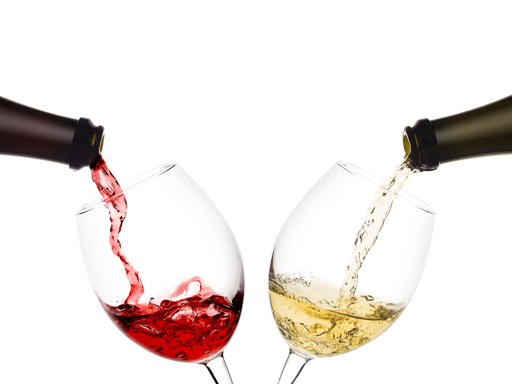
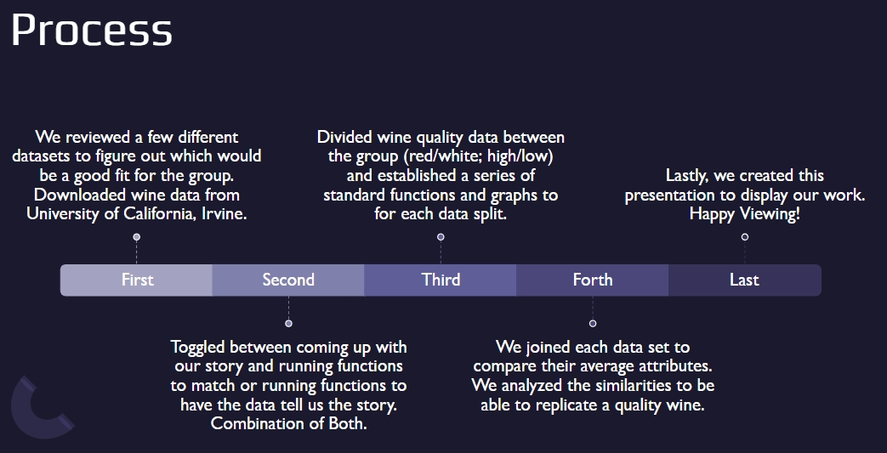
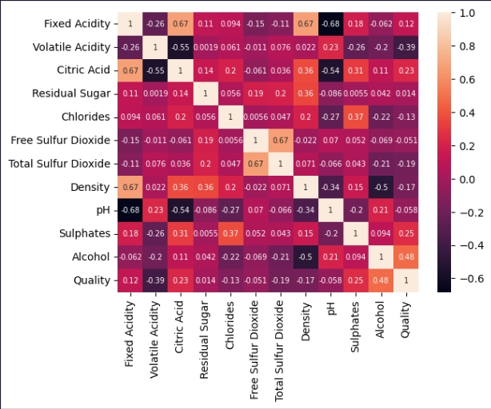
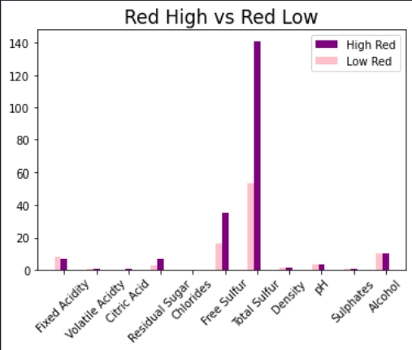
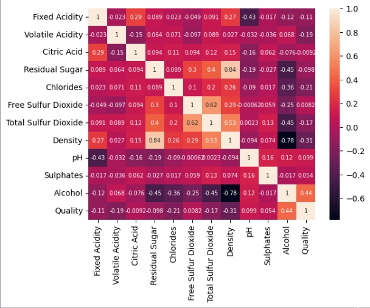
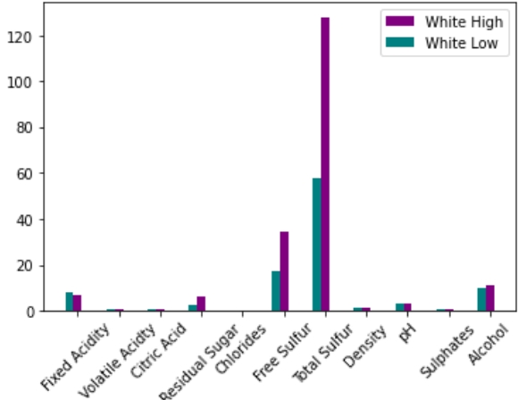
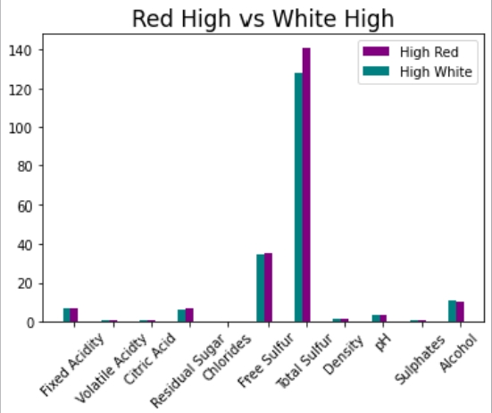
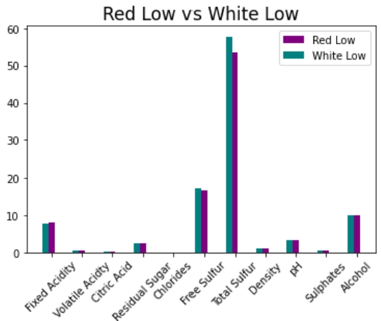

# Project: Wine Quality(Red Wine and White Wine)

Do you want to learn about what makes high-quality red wine and white wine from the physicochemical perspective? In this project, we use the data sources from Paulo Cortez, University of Minho, Guimarães, Portugal to execute an in-depth analysis of both types of wines(red and white) to figure out what attributes make the difference between high-quality wine and low-quality wine.

## Table of Contents

* Data Set & Hypothesis

* Process

* High/Low Quality Red Wines

* High/Low Quality White Wines

* Red Wine vs White Wine

* Conclusion 

## Data Set & Hypothesis

The data set provided allowed us to analyze red & white wine attributes by a high- and low-quality scoring scale. We will review the attributes that make up the best (high score) and worst (low score) quality wines.  From a business perspective, we are looking for high-quality wine attributes for winemakers to replicate and not replicate low-quality wines. 
Both the red and white wine dataset comes with 12 attributes and we divided the dataset into two groups: high-quality white wine and low-quality white wine by selecting the top 50 % of the row and the bottom 50 % of the rows.

Data Set: https://archive.ics.uci.edu/ml/datasets/Wine+Quality

## Process

## High/Low-Quality Red Wines

## High/Low-Quality White Wines

This heatmap visualizes the strength of relationships between the attributes.  The values in the cells indicate the strength of the relationship, with positive values indicating a positive relationship and negative values indicating a negative relationship. The color-coding of the cells makes it easy to identify relationships between variables at a glance. Darker colors represent the negative correlation and lighter colors represent the positive correlation. 

From this heatmap, we can see there is an obvious negative correlation that is the Density and Alcohol. The more alcohol a wine contains decreases the overall density of the wine. So a comparison between alcohol level and density shows an inverse relationship.

The attributes that have obvious positive correlation are: 

**1. Residual Sugar and Density:**  *(0.84)* Residual sugar is the amount of sugar remaining after fermentation stops. It has a positive correlation to the density of white wine.

**2. Total Sulfur Dioxide & Free Sulfur Dioxide:** *(0.62)* Total Sulfur Dioxide contains Free Sulfur Dioxide and Bond Sulfur Dioxide. They prevent microbial growth and the oxidation of the wine. Since free sulfur dioxide is a part of the total sulfur dioxide, it makes sense that they have a positive correlation.

**3. Density & Total Sulfur Dioxide:** *(0.53)* The heatmap also shows a positive correlation between density and total sulfur dioxide. This means the higher the total sulfur dioxide, the higher the density is.

This part is the bar chart of the high-quality and low-quality white wine comparison. The purple bars represent high-quality white wine. The teal bars represent the low-quality white wine. 

The attributes that don't show obvious differences between high-quality and low-quality white wine according to this bar chart are: Volatile acidity, Citric Acid, Density, pH, and Sulphates

The attributes that make the difference are:

**1. High-quality white wine has more sulfur dioxide:** Sulfur dioxide is the most widely used additive in winemaking. Due to its antimicrobial action and antioxidant effect, SO2 is able to protect wine from various unwanted reactions, so higher-quality white wine usually contains more sulfur dioxide because it stabilizes the quality.

**2. High-quality white wine has more residual sugar:** The more residual sugar remaining in a wine, the sweeter the wine is. So the organization creating the dataset that we are using might consider sweetness as part of the criteria when evaluating the quality of white wine. And this turns out that the higher the quality, the more residual sugar it has.

**3. High-quality white wine has less fixed acidity:** A wine with high acid will usually taste crisper and more tart on the palate. A low-acid wine will feel smoother and rounder on the palate. So we can infer that when evaluating the white wine, they consider the smoothness of the texture of the wine. That's why higher-quality white wine has lower fixed acidity according to our analysis.

**4. High-quality white wine has slightly more alcohol:** In fact, alcohol content affects a wine's body. A wine with a higher alcohol content will have a fuller, richer body, while a lower-alcohol wine will taste lighter and more delicate on the palate. 

## Red Wine vs White Wine

ATTRIBUTES OF HIGH-QUALITY WINE

* Free Sulfur Range: 30%-40% Average

* Total Sulfur Range: 120%-140% Average

* Residual Sugar Range: 5%-10% Average

* Alcohol Range: 10%-15% Average

ATTRIBUTES OF LOW-QUALITY WINE

* Free Sulfur Range: 15%-20% Average

* Total Sulfur Range: 50%-60% Average

* Residual Sugar Range: 1%-5% Average

* Alcohol Range: 10%-15% Average

## Summary
* After comparing 4,898 data points both high-quality and low-quality wines carry attributes that fall into a similar ranges to reproduce. High-quality wines carry higher overall attribute averages for both red and white wines. 

## High-Quality Red & High-Quality White Wines 
* Free Sulfur Range: 30%-40% Average
* Total Sulfur Range: 120%-140% Average
* Residual Sugar Range: 5%-10% Average
* Alcohol Range: 10%-15% Average

## Low-Quality Red & Low-Quality White Wines
* Free Sulfur Range: 15%-20% Average
* Total Sulfur Range: 50%-60% Average
* Residual Sugar Range: 1%-5% Average
* Alcohol Range: 10%-15% Average

## Limitations and Conclusion
### Limitations

1 Quality is subjective 

2 The dataset doesn’t account for all the different regions of wine 

3 The dataset doesn’t account for how the wine is made 

### Conclusion

--------------------------------------------------------------------------------------------
### Reference:
P. Cortez, A. Cerdeira, F. Almeida, T. Matos and J. Reis.
Modeling wine preferences by data mining from physicochemical properties. In Decision Support Systems, Elsevier, 47(4):547-553, 2009.
